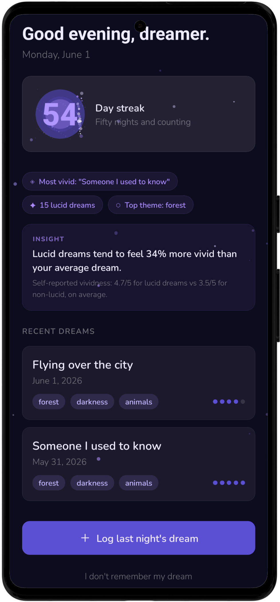
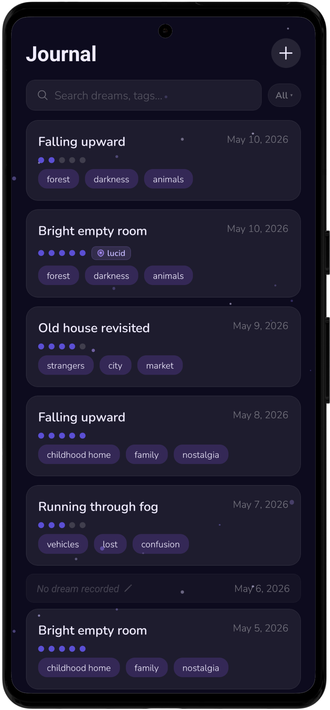
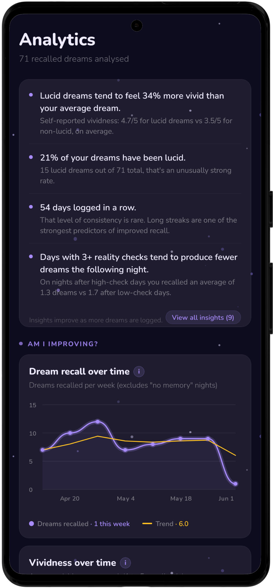
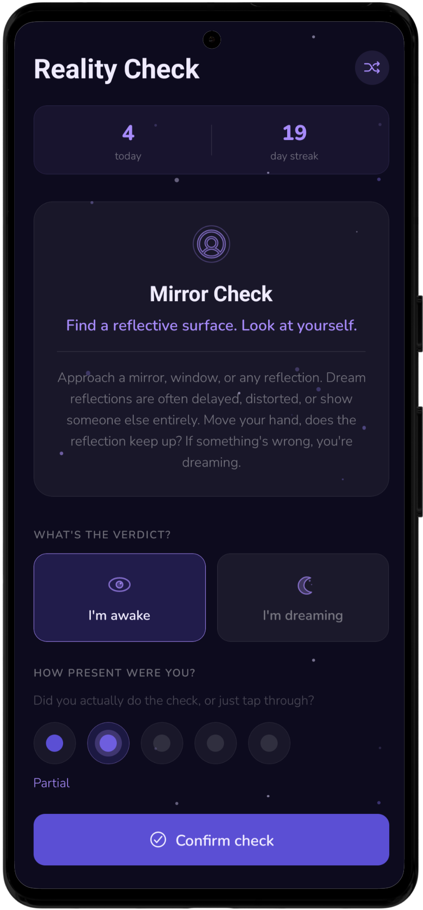
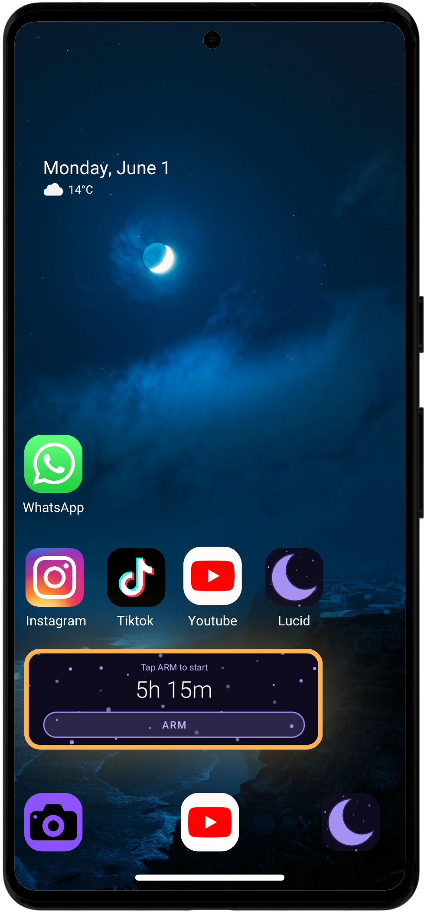

# Lucid

A free, private dream journal and lucid dreaming companion for Android.

I built this because I wanted to log my own dreams. I hadn't even checked the Play Store to see if something like this already existed. I just wanted something simple, local, and without a subscription.

---

## Download

[Download the latest APK](https://github.com/oneironautdev/Lucid/releases/latest)

---

## What it does

- **Dream journal** — log dreams with tags, mood, vividness, and a lucid dream flag. Search and filter by month. 1000 word limit with a live counter.
- **Analytics** — charts and stats built from your own data. Weekly recall trends, vividness over time, WBTB vs normal night comparisons, lucid dream rate, tag frequency, and a 49-day consistency grid.
- **Reality checks** — 8 guided techniques with SVG icons. Rate how present you were after each one. Tracks a daily count and consecutive day streak.
- **Reality check notifications** — up to 15 per day, randomized across a time window you set. 50 different notification messages so they don't all look the same.
- **WBTB home screen widget** — arm it before bed, it fires an alarm after your set sleep time and buffer. Escalating volume and vibration. History syncs to analytics.
- **Streak tracking** — consecutive logging streak with over 100 unique messages depending on your streak length.
- **PIN lock** — optional 4 to 6 digit PIN to lock the app.
- **Export and import** — your data as a JSON file. Useful for backups or moving to a new phone.
- **All data stored locally** — no accounts, no cloud, no data leaving your phone unless you export it yourself.

---

## Screenshots

<table>
  <tr>
    <td align="center"><b>Home</b></td>
    <td align="center"><b>Journal</b></td>
    <td align="center"><b>Analytics</b></td>
    <td align="center"><b>Reality Check</b></td>
    <td align="center"><b>Widget</b></td>
  </tr>
  <tr>
    <td></td>
    <td></td>
    <td></td>
    <td></td>
    <td></td>
  </tr>
</table>

| Home | Journal | Analytics | Reality Check | Widget |
|------|---------|-----------|---------------|--------|
|  |  |  |  |  |

---

## Tech stack

- React Native with Expo
- TypeScript
- Shopify Skia for charts
- AsyncStorage for local data
- Kotlin for the WBTB widget and alarm service (native Android)
- Expo Notifications for reality check reminders

---

## Building from source

You'll need Node.js, the Android SDK, and JDK 21.

```bash
git clone https://github.com/oneironautdev/Lucid
cd Lucid
npm install
```

**Dev build:**
```bash
export ANDROID_HOME=~/Android/Sdk
export JAVA_HOME=/path/to/jdk-21
npx expo run:android
```

**Release build:**
```bash
cd android
./gradlew assembleRelease
```

The APK will be at `android/app/build/outputs/apk/release/app-release.apk`.

---

## Links

- [Website](https://oneironautdev.github.io/Lucid)
- [Buy Me a Coffee](https://buymeacoffee.com/oneironautdev)
- [Contact](mailto:lucidapp.contact@gmail.com)

---

## License

MIT
